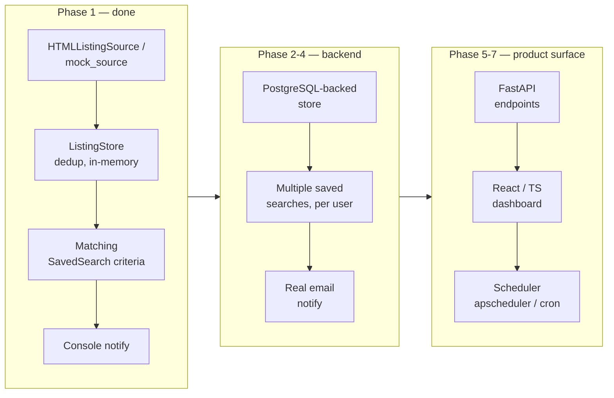

# Property Monitor — Phase 1

Core scraper + dedup + matching. Two sources are included:

- **`sources/mock_source.py`** — fake but realistic listings, no network.
- **`sources/html_source.py`** — a *generic, config-driven* scraper for
  individual independent agent sites (the whole point of this project:
  finding listings that don't surface on Zoopla/Rightmove).

## Why not scrape the big portals?

None of them currently offer a free, clearly permitted way to pull live
listings for a personal project — Zoopla's old public listings API has
been retired, and Rightmove/OnTheMarket restrict automated scraping in
their terms. Individual agent sites are the more interesting target
anyway (that's where the under-the-radar listings actually are), but
they vary site to site — there's no blanket "yes" or "no". So:

## Before pointing this at any real site

1. **Check robots.txt**, per-site, every time:
   ```bash
   python3 -m property_monitor.utils.robots https://the-agent-site.co.uk/listings
   ```
   This tells you if fetching is allowed and whether they've requested
   a crawl-delay (respect it — `HTMLListingSource` already does, via
   `polite_delay`).
2. **Read the site's actual Terms of Use page yourself.** robots.txt
   only governs automated crawlers; it isn't the same as full legal
   permission, and some sites forbid scraping in their terms even with
   a permissive robots.txt.
3. Only then, write a `SiteConfig` for that site (see below) and go.

`HTMLListingSource` itself also refuses to fetch anything that fails
the robots.txt check (raises `PermissionError`), so it can't be
pointed at a disallowed URL by accident.

## Adding a real site

Each site is just a `SiteConfig` — CSS selectors for where things live
on the listing page, no new scraper class needed:

```python
from property_monitor.sources import HTMLListingSource, SiteConfig

config = SiteConfig(
    source_name="acme-agents",
    base_url="https://acme-agents.example.co.uk",
    card_selector=".property-card",          # one per listing
    title_selector=".property-card__title",
    price_selector=".property-card__price",
    location_selector=".property-card__location",
    url_selector=".property-card__link",      # the <a> with the href
    bedrooms_selector=None,                    # optional; parsed from title if omitted
    id_attribute="data-listing-id",            # optional; falls back to the URL
)

source = HTMLListingSource(config, listings_url="https://acme-agents.example.co.uk/for-sale")
```

You'll work out the selectors by viewing the site's page source (or
browser devtools) — every agent site's HTML is different, that's the
whole reason this is config-driven rather than one-size-fits-all.

Swap this into `main.py` in place of (or alongside) `MockSource` —
`run_check()` doesn't care which `PropertySource` it's given.

## Structure

```
property-monitor/            <- open THIS folder as the IntelliJ/PyCharm project root
  pyproject.toml               project root marker + pytest config
  requirements.txt
  README.md
  property_monitor/            the actual package
    models.py                    Property, PropertyType, SavedSearch
    store.py                      in-memory dedup store (-> Postgres in Phase 2)
    utils/
      robots.py                    robots.txt permission + crawl-delay checker
    sources/
      base.py                        PropertySource interface
      mock_source.py                  fake listings for dev, no network
      html_source.py                  generic config-driven agent-site scraper
    tests/
      fixtures/sample_agent_listings.html   local HTML fixture (not a real site)
      test_html_source.py                    tests against the fixture, offline
    test_core.py                 dedup + matching tests
    main.py                      wires source -> dedup -> matching -> console alert
```

## Opening this in IntelliJ / PyCharm

1. Install the **Python plugin** if you're using plain IntelliJ (PyCharm has it built in).
2. **File → Open** and select the `property-monitor/` folder (the one with `pyproject.toml`, not the inner `property_monitor/`).
3. The IDE should auto-detect it as a Python project via `pyproject.toml`. If it doesn't prompt you, go to **Settings → Project → Python Interpreter** and add one (a new virtualenv is fine).
4. Right-click `requirements.txt` → **Install all packages**, or use the IDE terminal: `pip install -r requirements.txt`.
5. Right-click the `property_monitor` folder → **Run pytest in property_monitor** to run all 14 tests, or right-click `main.py` → **Run** for the mock-source demo.

## Run it

```bash
python3 -m property_monitor.main               # mock source demo
python3 -m property_monitor.utils.robots <url>  # check a real site first
```

## Test it

```bash
pip install -r requirements.txt
pytest -v
```

Note: this sandbox's own network is restricted to a small allowlist
(PyPI, GitHub, etc.), so the robots checker and HTML scraper can't
reach arbitrary sites from *here*. Run them locally, where you have
normal internet access, once you've picked and cleared a real site.

## Where this is going

This repo is Phase 1 of a 7-phase plan. The point of the finished
product is the UX — a dashboard you'd actually check day-to-day for
new listings that don't surface on the big portals — but a frontend
only means something once there's a real backend to point it at, so
it's sequenced last, not skipped:



- **Phase 2**: swap `ListingStore` for a real PostgreSQL-backed store — nothing persists between runs until this lands.
- **Phase 3**: multiple saved searches, persisted per user.
- **Phase 4**: replace the console `notify()` with real email sending.
- **Phase 5**: wrap this in FastAPI endpoints — `GET /listings`, `POST /saved-searches` — the contract the frontend builds against.
- **Phase 6**: React/TypeScript dashboard — saved searches, live listing feed, new-match alerts. Deliberately last: building it against Phase 1's in-memory store would mean rebuilding its data layer twice.
- **Phase 7**: add a scheduler (e.g. `apscheduler` or a cron job) to
  run `run_check()` on an interval per source, with the polite delays
  and robots checks already baked in.

