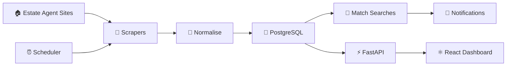

<div align="center">

# 🏠 Property Monitor

**A Python property listing monitor that finds new matching homes before you have to.**

[](https://www.python.org/)
[](https://www.crummy.com/software/BeautifulSoup/)
[](https://pytest.org/)
[](#-roadmap)

<br>

<a href="#-the-idea"><strong>✨ Explore the Project</strong></a>
&nbsp;&nbsp;•&nbsp;&nbsp;
<a href="#-how-it-works"><strong>🔎 How It Works</strong></a>
&nbsp;&nbsp;•&nbsp;&nbsp;
<a href="#-roadmap"><strong>🚀 Roadmap</strong></a>

</div>

---

## 💭 The Idea

Property hunting is already enough of a headache without constantly checking the same websites hoping something new appears.

**Property Monitor** is my attempt to automate that process.

The idea is simple: give the system a few requirements — **location, budget, bedrooms and property type** — and let it check approved estate-agent listing pages, spot new properties and eventually notify you when something matches.

For example:

> 📍 Canterbury  •  💷 ≤ £300,000  •  🛏️ 2+ bedrooms  •  🏠 House
>
> **→ New matching property found.**

The project started as a small Python scraper, but I'm building it out as a proper backend/full-stack system rather than stopping at scraping HTML.

---

## 🧠 The Challenge

The interesting part isn't just getting text from a webpage.

I wanted to build something that has to deal with **real engineering problems**:

- 🔎 Different estate-agent websites have completely different HTML
- 🆔 Listings need stable IDs so the same property isn't stored repeatedly
- 🎯 Properties need to be matched against saved search criteria
- 💾 Data eventually needs to persist between runs
- ⏰ The system needs to check for new listings automatically
- 🔔 New matches should trigger useful notifications rather than spam
- 🧪 Each part needs to be testable independently
- 🤝 Scraping needs to respect robots.txt, terms of use and crawl delays

That makes the project less about "scraping a website" and more about **designing a reliable monitoring system**.

---

## 🔎 How It Works

The current version follows this flow:

```text
🏠 Estate Agent Listings
          ↓
     🔎 HTML Scraper
          ↓
    🧹 Normalise Data
          ↓
      🆔 Deduplicate
          ↓
    🎯 Match Searches
          ↓
     🔔 Notify User
```

### 🧩 Config-Driven Scraping

Instead of writing a completely different scraper class for every estate agent, the project uses a `SiteConfig` containing CSS selectors for the important parts of a listing.

That means a new supported site can be configured without rewriting the entire scraping layer.

```python
config = SiteConfig(
    source_name="acme-agents",
    base_url="https://acme-agents.example.co.uk",
    card_selector=".property-card",
    title_selector=".property-card__title",
    price_selector=".property-card__price",
    location_selector=".property-card__location",
    url_selector=".property-card__link",
)
```

The parser is also separated from the network-fetching code, which makes the HTML parsing logic easier to test using local fixtures.

---

## 🛡️ Responsible Scraping

I'm deliberately **not** treating scraping as "send as many requests as possible".

Before connecting the monitor to a real site, the project is designed to:

1. Check the site's `robots.txt`
2. Respect any requested crawl delay
3. Read the site's Terms of Use
4. Only configure sources where automated access is appropriate
5. Avoid hammering websites with unnecessary requests

`HTMLListingSource` also checks `robots.txt` before fetching and applies a polite delay between requests.

**The goal is reliable monitoring, not aggressive scraping.**

---

## 🗃️ Data Model

Listings are represented as structured `Property` objects rather than leaving everything as raw HTML.

Each property can contain:

| Field | Purpose |
| --- | --- |
| `source_name` | Which estate-agent source it came from |
| `source_id` | Stable ID for the listing |
| `title` | Listing title |
| `price` | Price in GBP |
| `location` | Property location |
| `bedrooms` | Bedroom count |
| `property_type` | House, flat, bungalow, land or other |
| `url` | Link to the original listing |
| `first_seen` | When the monitor first encountered it |

The listing ID is built from the source and source-specific ID, giving the system a straightforward way to detect duplicates.

---

## 🎯 Saved Searches

The project also models user search criteria through `SavedSearch`.

A search can define:

```text
📍 Location
💷 Maximum price
🛏️ Minimum bedrooms
🏠 Property type
```

The matching logic then checks whether each property satisfies those requirements.

This is important because the end goal isn't just collecting properties — **it's finding the properties that actually matter to the user.**

---

## 🧪 Testing

The scraper is built around testable components rather than relying entirely on live websites.

The project includes tests for:

- HTML listing parsing
- Price extraction
- Bedroom extraction
- Property-type detection
- Listing IDs
- Deduplication
- Saved-search matching
- Local HTML fixtures

This means the core parsing behaviour can be tested offline without repeatedly requesting real websites.

Run the test suite with:

```bash
pip install -r requirements.txt
pytest -v
```

---

## 🛠️ Stack

| Technology | Why I'm using it |
| --- | --- |
| 🐍 **Python** | Main language |
| 🥣 **BeautifulSoup** | Parse listing HTML |
| 🌐 **Requests** | HTTP requests |
| 🧪 **Pytest** | Automated testing |
| 🧱 **Dataclasses** | Structured property/search models |
| 🗂️ **Sets** | Fast in-memory duplicate detection |
| 🔐 **robots.txt** | Respect crawler permissions |

### Planned Stack

```text
🐍 Python
   ↓
⚡ FastAPI
   ↓
🐘 PostgreSQL
   ↓
⚛️ React + TypeScript
   ↓
⏰ Scheduled monitoring
   ↓
📧 Email / 💬 Discord / 📱 Telegram
```

---

## 🗺️ Roadmap

This is being built in stages so I can actually understand each layer instead of throwing a huge stack together at once.

### ✅ Phase 1 — Core Monitoring

- [x] Generic HTML scraper
- [x] Mock source for development
- [x] Structured property models
- [x] Deduplication
- [x] Saved-search matching
- [x] Console notifications
- [x] robots.txt checking
- [x] Automated tests

### 🔄 Phase 2 — Persistence

- [ ] PostgreSQL database
- [ ] Persistent listings
- [ ] Persistent saved searches
- [ ] Better database-level deduplication

### 📬 Phase 3–4 — Users & Notifications

- [ ] Multiple saved searches per user
- [ ] Real email notifications
- [ ] Notification history
- [ ] Prevent repeated alerts

### ⚡ Phase 5 — API

- [ ] FastAPI backend
- [ ] `GET /listings`
- [ ] `POST /saved-searches`
- [ ] Search/filter endpoints
- [ ] Input validation

### 🎀 Phase 6 — Dashboard

- [ ] React + TypeScript frontend
- [ ] Saved-search dashboard
- [ ] New-property feed
- [ ] Property cards
- [ ] Search management

### ⏰ Phase 7 — Automation

- [ ] Scheduled monitoring
- [ ] Automatic source checks
- [ ] Retry/error handling
- [ ] Scraper health tracking
- [ ] Deployment

---

## 🔄 The Bigger Picture



The finished version should feel less like a script and more like a **small real-world product**: something that can continuously monitor sources, remember what it has already seen, understand what the user is looking for and surface useful matches.

---

## 💡 Why I'm Building It

This project is helping me go beyond individual programming exercises and think about how different parts of software fit together.

I'm getting hands-on practice with:

- **Software architecture** — separating models, sources, storage and application logic
- **Web scraping** — dealing with inconsistent real-world HTML
- **Data modelling** — representing listings and user searches cleanly
- **Algorithms & efficiency** — avoiding duplicate processing
- **Backend development** — building towards a proper API and database
- **Testing** — keeping core behaviour reliable as the project grows
- **System design** — turning a small idea into a multi-stage application

---

## 🚀 Next Steps

The next major milestone is **PostgreSQL**.

Once listings and saved searches persist properly, I'll build the FastAPI layer around them, then move towards the React dashboard and automated monitoring.

So for now:

**Scrape → Match → Learn → Build → Repeat.** 💅

---

<div align="center">

### 🏠 Property Monitor

**Built in Python • Currently in Phase 1 • More to come ✨**

</div>
